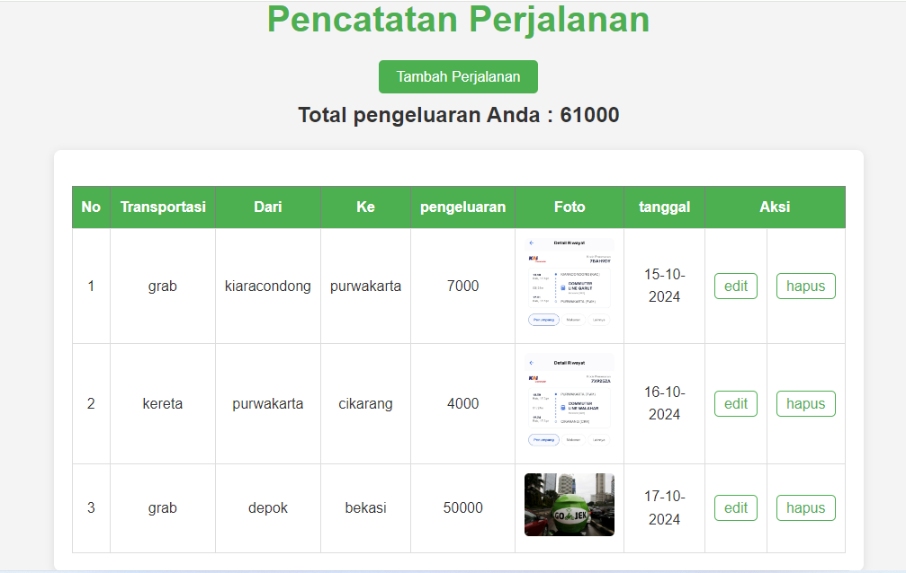
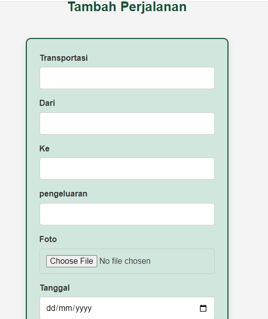
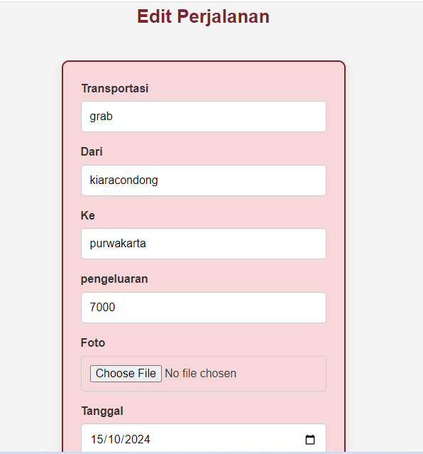

# Pencatatan Perjalanan

Pencatatan Perjalanan adalah aplikasi sederhana untuk mencatat dan mengelola pengeluaran perjalanan Anda. Aplikasi ini memungkinkan pengguna untuk menambahkan, mengedit, dan menghapus catatan perjalanan, serta melihat total pengeluaran.

## Fitur

- **Tambah Perjalanan:** Menambahkan rincian perjalanan baru, termasuk transportasi, lokasi awal, lokasi tujuan, pengeluaran, foto, dan tanggal perjalanan.

- **Edit Perjalanan:** Memperbarui informasi perjalanan yang telah ada.
- **Hapus Perjalanan:** Menghapus catatan perjalanan yang tidak lagi diperlukan.
- **Lihat Total Pengeluaran:** Menghitung dan menampilkan total pengeluaran dari semua perjalanan yang telah dicatat.

## Teknologi yang Digunakan

- **Bahasa Pemrograman:** PHP
- **Database:** SQLite
- **HTML/CSS:** Untuk tampilan dan antarmuka pengguna

## Cara Menggunakan

1. **Instalasi:**
   - Pastikan Anda memiliki server lokal seperti XAMPP atau MAMP yang terinstal.
   - Salin semua file ke dalam folder `htdocs` (untuk XAMPP) atau folder yang sesuai (untuk MAMP).

2. **Koneksi Database:**
   - Buka `db.php` dan sesuaikan pengaturan koneksi database jika diperlukan.

3. **Akses Aplikasi:**
   - Buka browser dan akses `http://localhost/pencatatan_perjalanan/perjalanan.php` untuk melihat aplikasi.

4. **Menambahkan Perjalanan:**
   - Klik tautan "Tambah Perjalanan" untuk membuka formulir input.
   - Isi semua rincian yang diperlukan dan unggah foto perjalanan Anda.
   - Klik "submit" untuk menyimpan perjalanan ke database.

5. **Mengedit dan Menghapus Perjalanan:**
   - Pada halaman utama, klik "edit" untuk mengubah rincian perjalanan yang sudah ada.
   - Klik "hapus" untuk menghapus perjalanan, dan konfirmasi tindakan tersebut.
